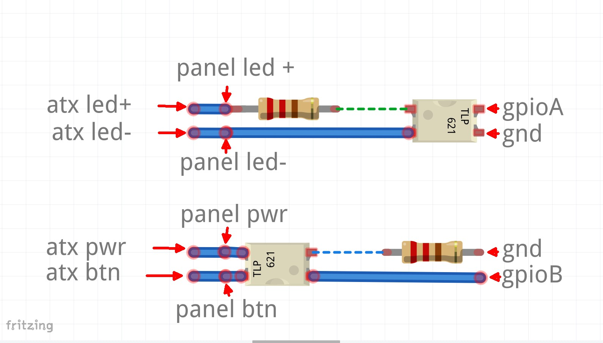

# remote-atx-power
Power on ATX remotely

## Requirements

* WiringPi compatible board (Raspberry Pi, Orange Pi, Odroid etc)
* 8 dupont female-female cables
* 2 resistors 
* 2 opto couplers
* 12 pins

## Schematics

Disconnect computer case panel's led and power button wires from your ATX mainboard and connect them to the remote board. Using dupont wires connect atx pins accordingly to the remote board so atx led+ is connected to panel's led+, atx led- to panel's led-, and same for power button contacts. Using dupont cables connect ground, gpioA and gpioB to any free digital gpio of your WiringPi compatible dev board. You will have to specify your PIN numbers in the action.sh script

Schema:

Physical board prototype:

## Usage

./action.sh [action]

Where action:

* (empty action) - single short power button press to power on
* off - check the power led and ping, if ATX is on - single short power button press to shutdown
* long - long power button press, should trigger acpi immediate power off
* dry - just print status

## Example

To turn power on:

`./action.sh`

Note: if the server is on the button will not be pressed to avoid accidental shutdown

To shutdown:

`./action off`
